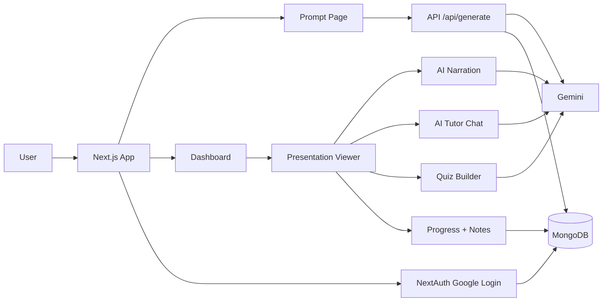
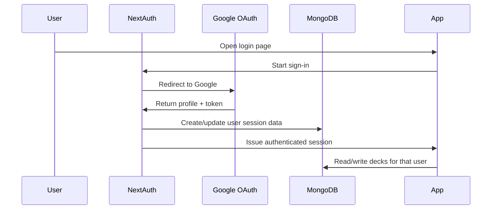

# OpenMaic

OpenMaic is an AI-powered learning and presentation platform that turns prompts into slide decks, adds narration, generates quizzes, and provides a topic-aware tutor alongside slides.

## Highlights

- Generate slide decks from a prompt
- Preview decks in an interactive presentation viewer
- Generate AI narration and audio support
- Ask a topic-aware AI tutor beside the current slide
- Save learning progress, current slide, watched time, and notes
- Generate quizzes from slide content and answer them interactively
- Authenticate with Google and role-based admin access

## Tech Stack

- Next.js 16 App Router
- React 19
- TypeScript
- Tailwind CSS 4
- MongoDB
- NextAuth
- Google Gemini API
- Bcrypt.js
- Puter/AI TTS support

## System Architecture



## AI Pipeline

### Deck generation

1. User enters a topic on the prompt page.
2. The app sends the topic, audience, tone, and slide count to `/api/generate`.
3. Gemini returns structured slide JSON.
4. The app normalizes the slides and stores them in MongoDB.
5. The deck appears in the dashboard and presentation viewer.

### Narration

1. The presentation page loads the selected deck.
2. The narration endpoint builds a prompt from slide titles, bullets, and notes.
3. Gemini returns narration segments in JSON.
4. The app stores narration in the deck document and can generate audio from it.

### Quiz generation

1. The user clicks `Generate Quiz`.
2. `/api/decks/[id]/quiz` sends the deck topic and slide context to Gemini.
3. Gemini returns 10 multiple-choice questions.
4. The quiz page renders questions, accepts answers, and shows a score out of 10 on submit.

### Topic tutor chat

1. The user opens the right-side tutor panel.
2. The current slide index, slide content, and recent conversation are sent to `/api/decks/[id]/chat`.
3. Gemini answers as a tutor, not just a slide summarizer, so it can explain concepts more broadly.

## Authentication Flow



## Database Schema

### `users`

- `name`
- `email`
- `image`
- `role`
- `createdAt`
- `updatedAt`

### `slideDecks`

- `userId`
- `userName`
- `userEmail`
- `topic`
- `slideCount`
- `audience`
- `tone`
- `slides[]`
- `narration`
- `audioData[]`
- `learningProgress`
- `quiz`
- `pdfGenerated`
- `pdfGeneratedAt`
- `createdAt`
- `updatedAt`

### `learningProgress`

- `currentSlideIndex`
- `watchedSeconds`
- `completedPercent`
- `notes`
- `updatedAt`

### `quiz`

- `topic`
- `questions[]`
- `question`
- `options[]`
- `correctLabel`
- `explanation`

## Folder Structure

```txt
app/
  admin/                Admin dashboard, users, decks, voice settings
  api/                  Route handlers for auth, decks, AI, quiz, progress
  dashboard/            User dashboard and saved learning cards
  login/                Login page and form
  presentation/[id]/    Presentation viewer, tutor chat, quiz page
  prompt/               Prompt entry and deck generation UI
  signup/               Signup page
components/
  narration/            Narration player and session provider
hooks/
  use-audio-sync.ts     Audio playback synchronization
  use-narration.ts      Narration state and generation hook
lib/
  auth.ts               NextAuth configuration
  deck-store.ts         MongoDB deck helpers and schema types
  learning-progress.ts  Learning progress types
  narration.ts          Narration data types
  quiz.ts               Quiz data types
  slide-chat.ts         Tutor chat types
  slide-generator.ts    Deck generation helpers
  mongodb.ts            MongoDB client singleton
public/                 Static assets
```

## Screenshots

Add a few screenshots here so reviewers can see the product quickly.

Suggested captures:

1. Dashboard with the `Resume Learning` card
2. Slide presentation with the tutor panel
3. Quiz page with scoring
4. Admin dashboard

Suggested file names:

- `public/docs/dashboard.png`
- `public/docs/presentation.png`
- `public/docs/quiz.png`
- `public/docs/admin.png`

Example:

```md

```

## Demo GIF

Add a short GIF or screen recording to show the core flow:

1. Generate a deck
2. Open a presentation
3. Ask the AI tutor a question
4. Generate a quiz
5. Submit answers and view score

Suggested file name:

- `public/docs/demo.gif`

Example:

```md

```

## Deployment Link

Replace the placeholder below with your live deployment URL.

- Live Demo: `https://your-openmaic-deployment.vercel.app`

## Environment Variables

Create `.env.local` with:

```bash
MONGODB_URL=
NEXTAUTH_SECRET=
NEXTAUTH_URL=
GOOGLE_CLIENT_ID=
GOOGLE_CLIENT_SECRET=
GEMINI_API_KEY=
ADMIN_EMAILS=
```

## Getting Started

```bash
npm install
npm run dev
```

Open [http://localhost:3000](http://localhost:3000) in your browser.

## Scripts

- `npm run dev` - start the development server
- `npm run build` - build for production
- `npm run start` - start the production server
- `npm run lint` - run ESLint

## Challenges Faced

- Normalizing Gemini output into predictable JSON for slides, narration, and quizzes
- Handling authentication and access control for per-user decks
- Keeping presentation state, narration, and quiz flows aligned with the active slide
- Storing and restoring learning progress across sessions
- Supporting multiple AI-powered features without cluttering the UI

## Future Improvements

- Streaming chat responses
- Full quiz scoring history
- Better progress analytics per deck
- Timed quizzes and review mode
- Rich note organization with tags and search
- Cloud storage for exported screenshots and demo media
- More polished mobile presentation controls

## Notes

- The project uses Google Fonts through `next/font`.
- If you deploy in an environment without Google Fonts access, consider switching to self-hosted fonts.

